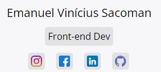

# Meu Portfólio 🌐

Este é meu  portfólio pessoal, onde me apresento e demonstro meus projetos. Este site foi criado utilizando o framework Angular 16 e hospedado no Firebase. Este site foi projetado para ser eficiente na visão de um recrutador ou de alguém que apenas está curioso.

> [Conheça meu site!](https://emanuelsacoman.web.app)

### ⚡ PageSpeed: 

Investi meu tempo para conseguir uma boa indexação no google! Com um bom ranqueamento, será mais fácil de encontrar meu site ao fazer uma pesquisa.

Não se esqueça de deixar uma ⭐ nesse repositório!